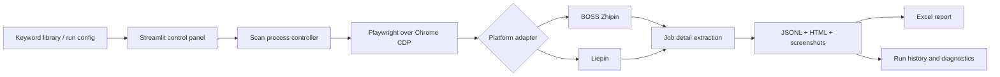

# AI Job Intelligence Collector

[简体中文](README.zh-CN.md)

A local-first job collection workflow for turning repeated job searches into structured research data. It connects to a dedicated Google Chrome session through the Chrome DevTools Protocol (CDP), searches configured keywords sequentially, opens real job-detail pages, and saves structured records, full-page screenshots, HTML snapshots, and Excel reports.

> Public portfolio edition: browser profiles, cookies, logs, real search results, local paths, and personal data are intentionally excluded.

## What it demonstrates

- Multi-platform adapter architecture for BOSS Zhipin and Liepin
- Stateful browser automation through Playwright + CDP
- Human-in-the-loop handling for login, captchas, and access checks
- Structured JSONL storage with deduplication and resumable runs
- Excel reporting, screenshot archiving, and run-level diagnostics
- Streamlit control panel for keyword libraries and task monitoring
- Automated tests for configuration, browser lifecycle, storage, selectors, and UI behavior

## Architecture



## Repository layout

```text
ai-job-intelligence-collector/
├── app.py                     # Streamlit control panel
├── main.py                    # CLI entry point and run orchestration
├── scrapers/                  # Platform-specific adapters
├── exporters/                 # Excel reporting
├── utils/                     # Browser, storage, runtime, and path utilities
├── tests/                     # Automated test suite
├── scripts/                   # Portable macOS launch/install scripts
├── docs/                      # Architecture and portfolio notes
├── sample_output/             # Synthetic, privacy-safe examples
├── config.json                # Safe default configuration
├── config.example.json        # Copyable configuration template
└── .env.example               # Optional path overrides
```

## Requirements

- Python 3.11+
- Google Chrome
- macOS or Windows
- Manual login to the selected recruitment platform

## Install

### macOS / Linux shell

```bash
python3 -m venv .venv
source .venv/bin/activate
python -m pip install -r requirements.txt
```

### Windows PowerShell

```powershell
py -3.11 -m venv .venv
.venv\Scripts\Activate.ps1
python -m pip install -r requirements.txt
```

## Quick start

### 1. Start a dedicated Chrome session

macOS:

```bash
mkdir -p "$HOME/.ai-job-collector-chrome"
"/Applications/Google Chrome.app/Contents/MacOS/Google Chrome" \
  --remote-debugging-port=9222 \
  --user-data-dir="$HOME/.ai-job-collector-chrome"
```

Open BOSS Zhipin or Liepin in that Chrome window and sign in manually.

### 2. Run the Streamlit interface

```bash
python -m streamlit run app.py
```

Open `http://127.0.0.1:8501`.

### 3. Or run from the CLI

```bash
python main.py --config config.json --debug
python main.py --platform boss --keyword "quantitative trading support" --limit 3
python main.py --platform liepin --keywords "trading systems operations,financial software testing" --limit 5
```

## Configuration

```json
{
  "platform": "boss",
  "jobs_per_keyword": 10,
  "search_keywords": [
    "quantitative trading support",
    "trading systems operations",
    "financial software testing"
  ],
  "city": "Shanghai",
  "experience": "",
  "education": "",
  "salary": "",
  "save_mode": "snapshot",
  "wait_seconds_min": 6,
  "wait_seconds_max": 10
}
```

`save_mode` supports:

- `snapshot`: save the current search snapshot
- `new_only`: skip jobs already collected in previous runs

## Output

Each run creates a dedicated directory containing:

```text
<run>/
├── jobs.xlsx
├── screenshots/
└── internal/
    ├── jobs.jsonl
    ├── invalid_records.jsonl
    ├── run_config.json
    ├── task_state.json
    ├── app.log
    ├── html/
    └── debug/
```

The Excel workbook contains raw job fields, long-form descriptions, invalid records, keyword summaries, run logs, and an interview-feedback sheet.

A synthetic example is included in [`sample_output/`](sample_output/).

## macOS desktop launcher

The installer resolves the repository path dynamically and creates a desktop app:

```bash
chmod +x scripts/install_macos_app.sh
./scripts/install_macos_app.sh
```

The default workspace is:

```text
~/Desktop/AI Job Intelligence Collector/
├── results/
├── logs/
└── config/
```

## Tests

```bash
python -m pytest -q
python -m compileall -q .
```

## Design boundaries

- Uses visible browser pages through Playwright/CDP
- Does not automate account login
- Pauses for manual handling of captchas or access checks
- Does not include browser profiles, cookies, credentials, or real candidate data
- Platform selectors may require maintenance when websites change

## Portfolio positioning

This repository is intended to demonstrate product thinking and engineering execution rather than the economic value of scraped data. The core story is: a repetitive job-search workflow was converted into a local, observable, testable automation system with reusable adapters and structured outputs.
