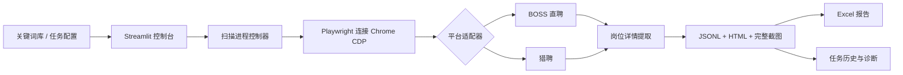

# AI 岗位情报采集器

[English](README.md)

一个本地优先的岗位采集与研究工作流。系统通过 Chrome DevTools Protocol（CDP）连接独立 Google Chrome，按关键词串行搜索岗位，打开真实详情页，并保存结构化记录、完整截图、HTML 快照与 Excel 报告。

> 这是用于公开展示的版本：浏览器配置、Cookie、日志、真实采集结果、本机路径及个人数据均已移除。

## 展示的工程能力

- BOSS 直聘与猎聘的平台适配器架构
- Playwright + CDP 的有状态浏览器自动化
- 登录、验证码、访问异常的人机协同处理
- JSONL 增量存储、去重、任务恢复与运行归档
- Excel 报告、完整截图、HTML 与调试现场保存
- Streamlit 控制台、关键词库与任务状态监控
- 配置、浏览器生命周期、存储、选择器和 UI 自动化测试

## 系统架构



## 项目结构

```text
ai-job-intelligence-collector/
├── app.py                     # Streamlit 控制台
├── main.py                    # 命令行入口与任务编排
├── scrapers/                  # 平台适配器
├── exporters/                 # Excel 导出
├── utils/                     # 浏览器、存储、运行参数与路径工具
├── tests/                     # 自动化测试
├── scripts/                   # 可移植的 macOS 启动与安装脚本
├── docs/                      # 架构和项目展示材料
├── sample_output/             # 脱敏的合成示例
├── config.json                # 安全默认配置
├── config.example.json        # 配置模板
└── .env.example               # 可选路径覆盖
```

## 安装

macOS：

```bash
python3 -m venv .venv
source .venv/bin/activate
python -m pip install -r requirements.txt
```

Windows PowerShell：

```powershell
py -3.11 -m venv .venv
.venv\Scripts\Activate.ps1
python -m pip install -r requirements.txt
```

## 快速运行

### 1. 启动独立 Chrome

```bash
mkdir -p "$HOME/.ai-job-collector-chrome"
"/Applications/Google Chrome.app/Contents/MacOS/Google Chrome" \
  --remote-debugging-port=9222 \
  --user-data-dir="$HOME/.ai-job-collector-chrome"
```

在该 Chrome 中打开 BOSS 直聘或猎聘并人工登录。

### 2. 启动界面

```bash
python -m streamlit run app.py
```

打开 `http://127.0.0.1:8501`。

### 3. 命令行运行

```bash
python main.py --config config.json --debug
python main.py --platform boss --keyword "量化交易支持" --limit 3
python main.py --platform liepin --keywords "交易系统运维,金融软件测试" --limit 5
```

## 配置示例

```json
{
  "platform": "boss",
  "jobs_per_keyword": 10,
  "search_keywords": [
    "量化交易支持",
    "交易系统运维",
    "金融软件测试"
  ],
  "city": "上海",
  "experience": "",
  "education": "",
  "salary": "",
  "save_mode": "snapshot",
  "wait_seconds_min": 6,
  "wait_seconds_max": 10
}
```

`save_mode`：

- `snapshot`：保存本次搜索快照
- `new_only`：跳过历史任务中已经采集的岗位

## 输出结构

```text
<run>/
├── jobs.xlsx
├── screenshots/
└── internal/
    ├── jobs.jsonl
    ├── invalid_records.jsonl
    ├── run_config.json
    ├── task_state.json
    ├── app.log
    ├── html/
    └── debug/
```

Excel 包含原始岗位字段、完整岗位描述、无效记录、关键词统计、运行日志和面试反馈表。

## macOS 桌面启动器

```bash
chmod +x scripts/install_macos_app.sh
./scripts/install_macos_app.sh
```

默认工作目录：

```text
~/Desktop/AI Job Intelligence Collector/
├── results/
├── logs/
└── config/
```

## 测试

```bash
python -m pytest -q
python -m compileall -q .
```

## 公开边界

- 只通过可见网页和 Playwright/CDP 工作
- 不自动登录账号
- 验证码与访问异常交由人工处理
- 不包含浏览器配置、Cookie、凭据和真实个人数据
- 招聘网站页面变化后，平台选择器可能需要维护

## 项目展示定位

这个项目的价值不在采集数据本身，而在于展示：如何把重复、混乱的求职流程转化为可运行、可观察、可测试、可复用的自动化系统。
